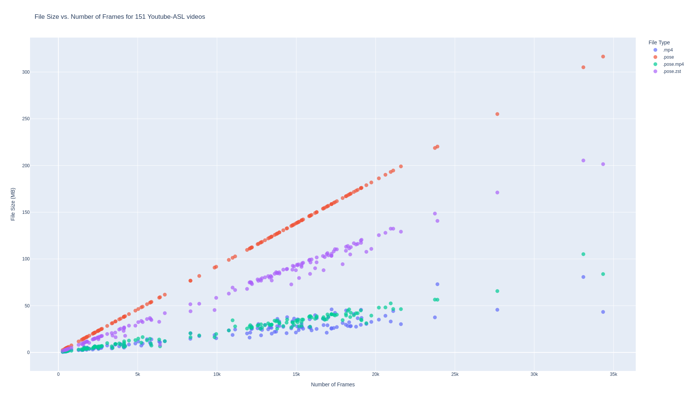

# pose-compression

Can we improve context window and/or reduce computation/hard drive space for pose-based Sign Language Processing by leveraging compression schemes? 

I'm curious to investigate whether we can compress [.pose files](https://pose-format.readthedocs.io/), and then do our sign-language processing _on those compressed files_. Figuring out how to compress them would also be useful just for saving hard drive space - a typical .pose is much larger than the .mp4 it came from. 

## Compression schemes to try:

### General Compression Algorithms
General file compression algorithms make a good baseline. I've found that simply using [`pyzstd`](https://github.com/Rogdham/pyzstd) works fastest and saves 30-50% hard drive space, though I did also . Turns out .xz can get them a bit smaller but at the cost of taking _forever_.

### Video Compression

* Video compression. Quite a simple idea: create a visualization of the .pose file, modified so every point has a different color, maybe use one of the RGB channels for depth. Let .mp4 handle the compression. Later, read back the coordinates of the various shapes to recover joint positions.

### Trajectory compression algorithms
Trajectory compression algorithms like Douglas-Peucker, SQUISH-E, and so forth

### Topological algorithms like Mapper that work on point clouds
* https://mapperinteractive.github.io/
* https://www.quantmetry.com/blog/topological-data-analysis-with-mapper/
* https://giotto-ai.github.io/gtda-docs/latest/notebooks/mapper_quickstart.html

### Adaptive Resonance Theory?
I'm told that ART networks can be used for clustering and unsupervised learning, as well as things like [image compression](https://www.spiedigitallibrary.org/journals/Journal-of-Electronic-Imaging/volume-14/issue-2/023009/Adaptive-technique-for-image-compression-based-on-vector-quantization-using/10.1117/1.1901678.short).

Some code: 
* https://github.com/NiklasMelton/AdaptiveResonanceLib has a library, pip installable, with some simple examples. 
* ACIL group does various ART work: https://github.com/NiklasMelton/AdaptiveResonanceLib
